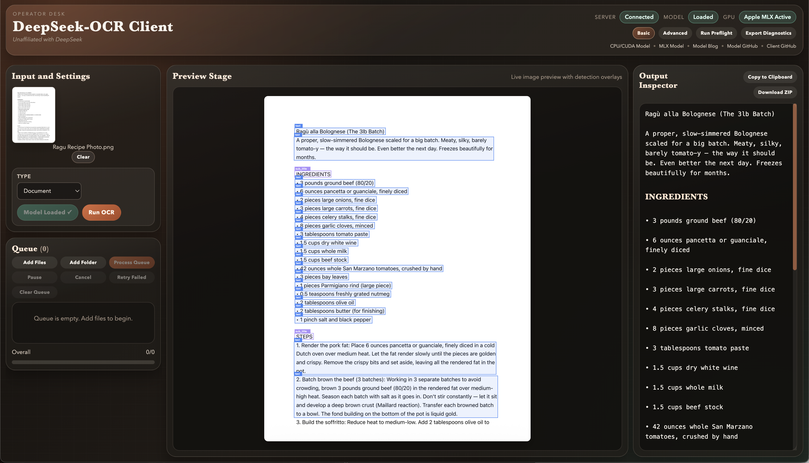
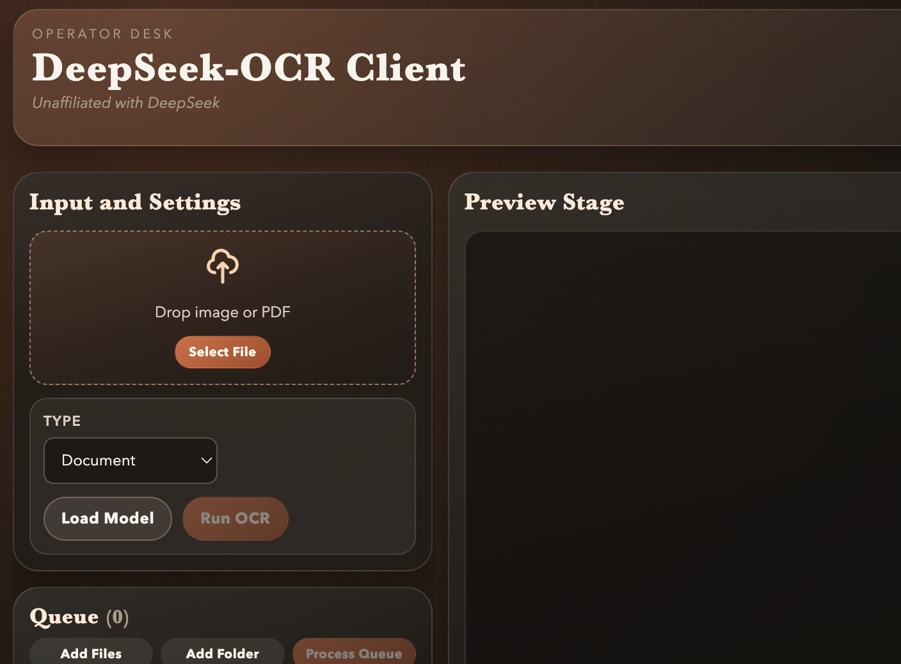
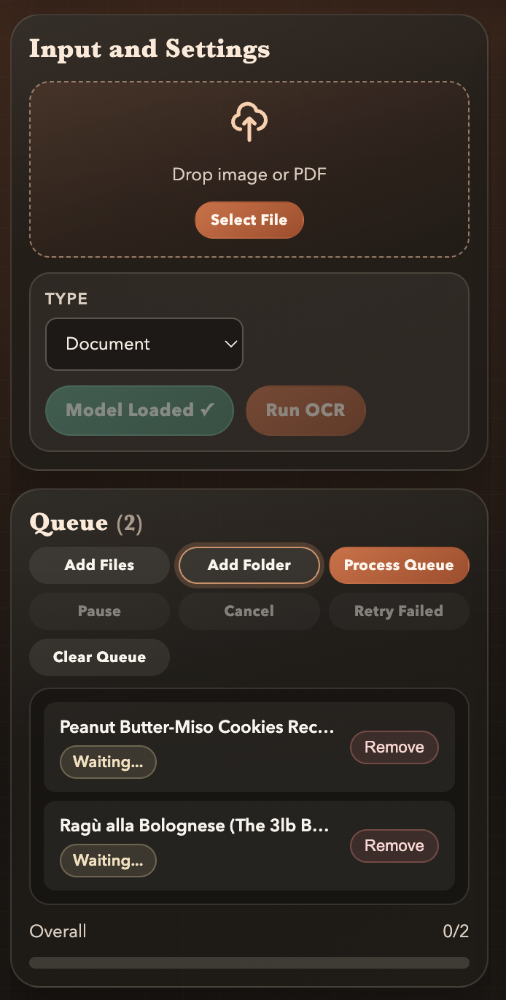
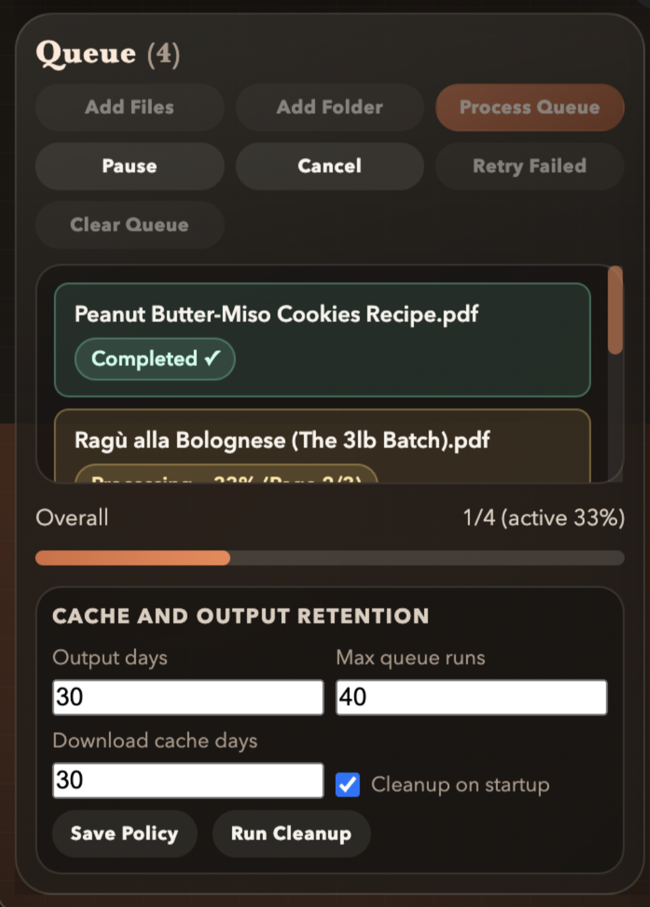
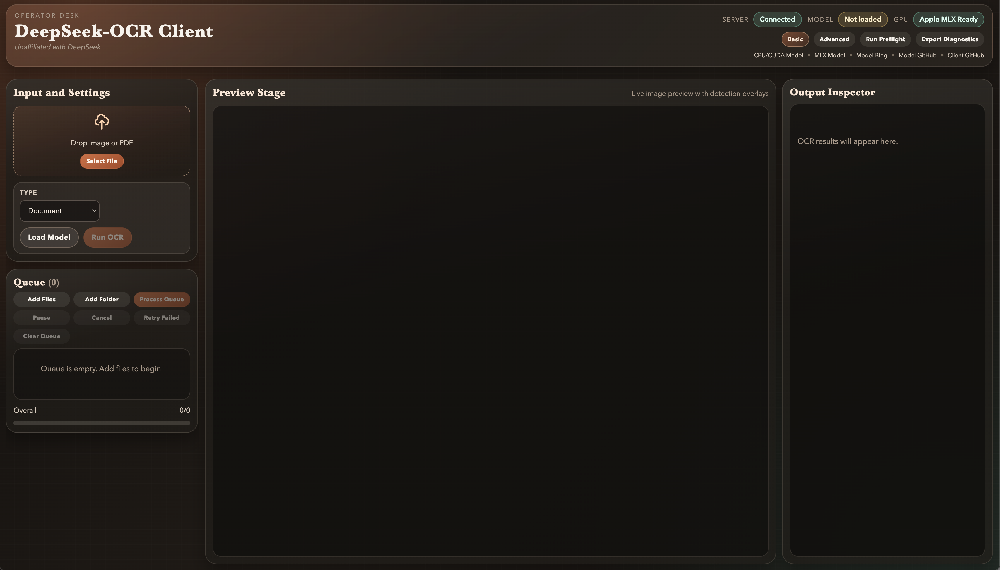

# DeepSeek-OCR-2 Client

**A desktop OCR workspace for [DeepSeek-OCR-2](https://github.com/deepseek-ai/DeepSeek-OCR-2) with live overlay preview, queue processing, and automatic hardware-aware setup.**

This project is unaffiliated with DeepSeek.



## Why This Client

If you want OCR that is:
- local-first
- fast on your available hardware
- easy for non-technical users
- still scriptable for advanced users

this app is designed for that exact flow.

It gives you one desktop surface for:
- image and PDF OCR
- queue/batch processing
- live detection overlays
- setup diagnostics and retention controls
- optional MCP control from Codex/Claude/CLI tooling

## Install (Simple Path)

1. Open the [Releases page](https://github.com/jmoore2333/deepseek-ocr-client/releases).
2. Download the installer for your platform.
3. Launch the app.
4. On first run, let setup finish (runtime + dependencies + model preparation).

## 3-Minute First OCR

1. Start the app.
2. Click `Load Model`.
3. Drag in an image or PDF (or click `Select File`).
4. Keep `Type = Document` unless you need a different mode.
5. Click `Run OCR`.
6. Review output in `Output Inspector`.
7. Use `Copy to Clipboard` or `Download ZIP`.



## Queue / Batch Workflow

1. Use `Add Files` or `Add Folder`.
2. Optional: set PDF page ranges (for example `1-3,5`).
3. Click `Process Queue`.
4. While running, you can `Pause`, `Cancel`, or `Retry Failed`.




## Basic vs Advanced Mode

- `Basic`: minimal controls for fast OCR.
- `Advanced`: full tuning, preflight checks, diagnostics export, retention policy.




## Hardware Backends and Models

The app routes by platform automatically:

| Platform / Device | Runtime Backend | Default Model |
|---|---|---|
| Apple Silicon (macOS arm64) | MLX (`mlx`, `mlx-vlm`) | [`mlx-community/DeepSeek-OCR-2-8bit`](https://huggingface.co/mlx-community/DeepSeek-OCR-2-8bit) |
| NVIDIA CUDA (Windows/Linux) | PyTorch | [`deepseek-ai/DeepSeek-OCR-2`](https://huggingface.co/deepseek-ai/DeepSeek-OCR-2) |
| CPU fallback (Windows/Linux/Intel macOS) | PyTorch | [`deepseek-ai/DeepSeek-OCR-2`](https://huggingface.co/deepseek-ai/DeepSeek-OCR-2) |

You can override the model with `MODEL_NAME` if needed.

## Reliability Features

- First-run managed runtime setup with bundled `uv`
- Hardware-aware environment provisioning
- Startup status and preflight estimator
- Diagnostics export (`ZIP`)
- Retention policies for outputs/cache
- Queue controls: pause/resume/cancel/retry

## MCP Server (Codex / CLI / Claude / Other MCP Clients)

MCP server is included at `backend/mcp_server.py`.

It supports:
- model load
- single OCR
- queue add/status/process/pause/resume/cancel/retry
- diagnostics export
- retention policy operations

Quick reference and configs:
- [`docs/mcp-server.md`](docs/mcp-server.md)

## Build From Source

### Prerequisites

- Node.js 18+
- Python 3.10-3.12
- Optional CUDA-capable NVIDIA GPU for CUDA acceleration

### Run in development

```bash
npm ci
./start-client.sh
```

Windows:

```bat
npm ci
start-client.bat
```

### Tests

```bash
npm run test:e2e
npm run test:build:smoke
npm run test:dist:host
```

### Build installers

Windows:

```powershell
powershell -ExecutionPolicy Bypass -File .\scripts\build-release.ps1
```

macOS/Linux:

```bash
bash ./scripts/build-release.sh
```

Manual distro commands:

```bash
npm run dist:win
npm run dist:mac
npm run dist:linux
```

## Troubleshooting

- Setup stuck or failing:
  - Run `Run Preflight`
  - Check internet/disk availability
- Windows build script behavior for `winCodeSign` symlink restrictions:
  - `.\scripts\build-release.ps1` now auto-falls back to a compatibility build mode when the shell cannot create symlinks.
  - Compatibility mode disables executable editing/signing (`signAndEditExecutable=false`), so installer output works but EXE icon/version metadata can differ.
  - For full executable editing behavior, enable `Developer Mode` or run PowerShell as Administrator.
- Model/runtime issues:
  - Use `Export Diagnostics`
  - Inspect `diagnostics.json` and log tails
- Queue appears stalled:
  - Verify pause/cancel state
  - Retry failed items
- Linux release builds on restricted endpoints:
  - `scripts/build-release.sh` now defaults `ELECTRON_BUILDER_CACHE` to project-local `.cache/electron-builder`.
  - If AppImage/deb tool downloads are blocked, build an unpacked artifact with:
    - `LINUX_TARGETS="dir" bash ./scripts/build-release.sh`
  - For full installer output (`AppImage` + `deb`), rerun with network access or a prewarmed builder cache.
- uv runtime download fails during release build:
  - The script reuses `runtime/uv` or a system `uv` on `PATH` before downloading.
  - Set `FORCE_UV_DOWNLOAD=1` to force a fresh pinned download.
- Linux CUDA out-of-memory during OCR:
  - Backend now defaults `PYTORCH_CUDA_ALLOC_CONF=expandable_segments:True` on Linux only.
  - `torch.compile` is disabled by default on Linux CUDA for stability (enable with `DEEPSEEK_OCR_ENABLE_TORCH_COMPILE=1`).
  - On Linux CUDA OOM, backend auto-retries once with lower memory settings (smaller base/size, crop off, lower token cap).
  - To disable Linux-only retry behavior: `DEEPSEEK_OCR_LINUX_CUDA_OOM_RETRY=0`.

## Technical Notes

- Electron main process: `main.js`
- Secure renderer bridge: `preload.js`
- UI logic: `renderer.js`
- OCR backend: `backend/ocr_server.py`
- MCP server: `backend/mcp_server.py`
- E2E tests: `tests/e2e/`
- CI workflows: `.github/workflows/`

## Upstream/Fork Context

Original upstream:
- [ihatecsv/deepseek-ocr-client](https://github.com/ihatecsv/deepseek-ocr-client)

This repository is an actively maintained fork focused on production desktop workflows, hardware-aware runtime setup, and DeepSeek-OCR-2 integration.

## License

MIT
